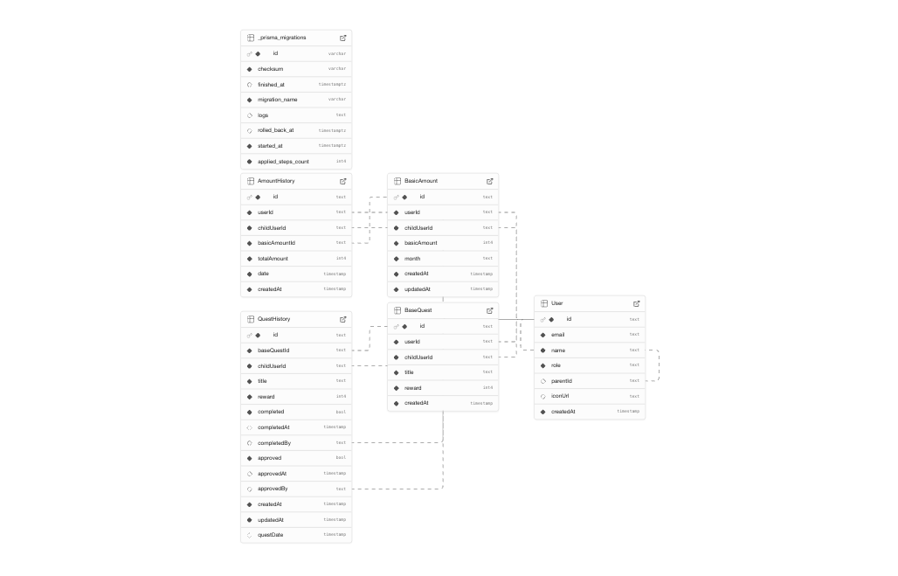

# 🐷 マネぶた｜おこづかいクエスト

## 📌 アプリの概要

**マネぶた** は、親子で使えるおこづかい管理アプリです。  
お手伝い（＝クエスト）を通じて子どもがお金の価値や努力の対価を学べるように設計されています。  
親が管理者として月額おこづかいや報酬を設定し、子どもは残高や履歴を見ながら楽しく学べます。

---

## 🔗 公開サイト URL

🔗 [https://moneybuta.vercel.app](https://moneybuta.vercel.app)

---

## ✨ 主な機能

- 毎月定額のおこづかい設定
- お手伝い報酬の登録・管理
- 日々の実績と残高の可視化
- 承認フローによる親子連携

---

## 🧪 テスト用アカウント

- **親アカウント（子ども設定有り）**

  - メール: `parent@moneybuta.local`
  - パスワード: `test000_2025`

- **親アカウント（子ども設定無し）**

  - メール: `parent02@moneybuta.local`
  - パスワード: `test000_2025`

- **子アカウント**

  - **子ども１**
  - メール: `child01`
  - パスワード: `test000_2025`

  - **子ども２**
  - メール: `child02`
  - パスワード: `test000_2025`

  - **子ども３**
  - メール: `child03`
  - パスワード: `test000_2025`

---

## 🎨 デザインカンプ

[Figma プロトタイプを見る](https://www.figma.com/proto/RxqgpIeFS0N2erNlHvMkIu/%E3%83%9E%E3%83%8D%E3%81%B6%E3%81%9F%E3%82%A2%E3%83%97%E3%83%AA?page-id=0%3A1&node-id=20-2&viewport=-339%2C574%2C0.08&t=vJGuHJtnMa706zfG-1&scaling=contain&content-scaling=fixed)

---

## 🛠 技術スタック

### 🚀 フレームワーク・言語

- Next.js (App Router)
- TypeScript

### 🎨 UI・アニメーション

- Tailwind CSS
- shadcn/ui
- lucide-react

### ⚙️ 状態管理・通信

- Zustand
- SWR

### 🔐 認証・データベース

- Supabase Auth（メール認証 + 仮アドレス対応）
- Prisma（Supabase PostgreSQL 接続）
- Vercel Cron Jobs（バッチ処理：金額集計・クエスト生成）

### 📊 チャート・可視化

- Recharts（報酬推移のグラフ表示）

---

## 📋 機能一覧

### 👶 子ども向け

- サインイン／サインアウト
- おこづかい残高の確認
- おこづかいの履歴グラフ表示
- お手伝い（クエスト）完了ボタンの実行
- アバター表示（今後カスタマイズ要素追加予定）

### 👨‍👩‍👧‍👦 親向け

- サインアップ／サインイン／サインアウト／子アカウント管理
- 毎月の基本おこづかいの設定
- お手伝い（クエスト）内容の登録・編集・削除
- 子どもの報告内容の承認（報酬の確定）

### 🔁 共通機能

- サインイン状態管理（sessionStorage + Zustand）
- エラー・トースト通知
- スマホ・PC に応じた UI 最適化
- 使い方ガイド

---

## 🗂 ディレクトリ構成（抜粋）

```bash
├── app/
│   ├── page.tsx（App Router）
│   ├── api/amount/...
│   ├── api/quest/...
├── components/
│   ├── IncomeChart.tsx
│   ├── CurrentAmount.tsx
├── lib/
│   ├── prisma.ts
│   ├── seed/
├── store/
│   ├── authStore.ts
│   ├── selectedChildStore.ts
├── types/
│   ├── MonthlyAmountType.ts
```

---

## 🧾 データベーススキーマ（ER 図）



### 主なテーブル構造

- `Users`: Supabase 管理（親／子）
- `BasicAmounts`: 毎月の定額おこづかい
- `AmountHistories`: 日次の残高記録（基本額 + 報酬）
- `BaseQuests`: 各子どもが持つお手伝いリスト
- `QuestHistories`: 日次の実行＆承認されたクエスト履歴

---

## 🔄 定期バッチ処理

- `/api/amount/today`：0 時 5 分実行、金額履歴を作成・更新
- `/api/quest/genarate`：0 時 0 分実行、クエスト履歴を生成
- Vercel Cron Jobs にて毎日自動実行

---

## 📝 開発メモ

- Zustand で認証状態・選択中の子アカウントを保持
- sessionStorage でアクセストークン保存（開発環境向け）
- Supabase の Service Role Key を用いたサーバー側処理

---

## 📄 ライセンス

© 2025 マネぶた おこづかいクエスト  
All rights reserved.
